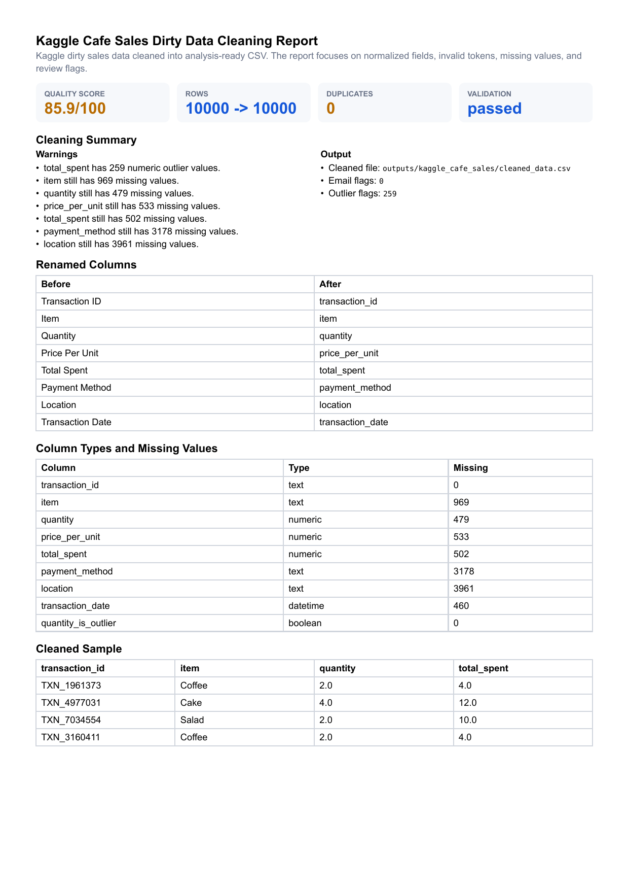

# CSV Excel Cleaning Toolkit

[](https://github.com/emirhuseynrmx/csv-excel-cleaning-toolkit/actions)
[](https://www.python.org/)

Reusable Python toolkit for cleaning messy CSV and Excel files into analysis-ready outputs.

The main demo uses Kaggle's **Cafe Sales - Dirty Data for Cleaning Training**
dataset: 10,000 transaction rows with `UNKNOWN`, `ERROR`, missing categories,
dirty numeric fields, and review-worthy totals.

## What It Does

- reads `.csv`, `.xlsx`, and `.xls`
- normalizes column names to `snake_case`
- trims whitespace in text columns
- normalizes email columns
- validates email columns and adds `*_is_valid` quality flags
- converts dirty tokens such as `UNKNOWN`, `ERROR`, `N/A`, and empty strings to missing values
- coerces numeric-looking columns such as spend, price, amount, orders, and revenue
- flags numeric outliers with IQR-based `*_is_outlier` columns
- infers basic column types for the report
- removes duplicate rows
- fills missing values from a JSON profile
- validates the final table shape with Pandera
- exports clean CSV or Excel
- writes a Markdown report with row counts, duplicate counts, missing values, and changed columns

## Demo

```bash
pip install -e ".[dev]"
clean-data data/kaggle_dirty_cafe_sales.csv \
  --out outputs/kaggle_cafe_sales/cleaned_data.csv \
  --report outputs/kaggle_cafe_sales/report.md
```

Generate a PDF report with Typst:

```bash
generate-cleaning-report data/kaggle_dirty_cafe_sales.csv \
  --out outputs/kaggle_cafe_sales \
  --title "Kaggle Cafe Sales Dirty Data Cleaning Report"
```

Report files:

- `outputs/kaggle_cafe_sales/cleaned_data.csv`
- `outputs/kaggle_cafe_sales/cleaning_report.typ`
- `outputs/kaggle_cafe_sales/cleaning_report.pdf`



Dataset source: [Cafe Sales - Dirty Data for Cleaning Training](https://www.kaggle.com/datasets/ahmedmohamed2003/cafe-sales-dirty-data-for-cleaning-training)

Use a cleaning profile:

```bash
clean-data \
  data/kaggle_dirty_cafe_sales.csv \
  --profile examples/cafe_sales_profile.json \
  --out outputs/kaggle_cafe_sales/cleaned_with_profile.xlsx \
  --report outputs/kaggle_cafe_sales/profile_report.md
```

## Example Output

Input columns like:

```text
 Customer Name , Email Address , Signup Date , Total Spend 
```

become:

```text
customer_name,email_address,signup_date,total_spend
```

The report includes:

- input rows and output rows
- duplicates removed
- missing values before and after cleaning
- renamed columns
- inferred column types
- invalid email counts
- numeric outlier counts
- Pandera validation status
- exported file path

## Run Tests

```bash
ruff check .
pytest
```

## Use Cases

- messy customer CSV cleanup
- Excel file preparation for dashboards
- email list normalization
- CRM import preparation
- deduplication before outreach
- repeatable tabular data workflows

## Scope

This toolkit cleans tabular files. It does not guess business rules automatically; those rules should be provided through a profile or reviewed with the final report.
